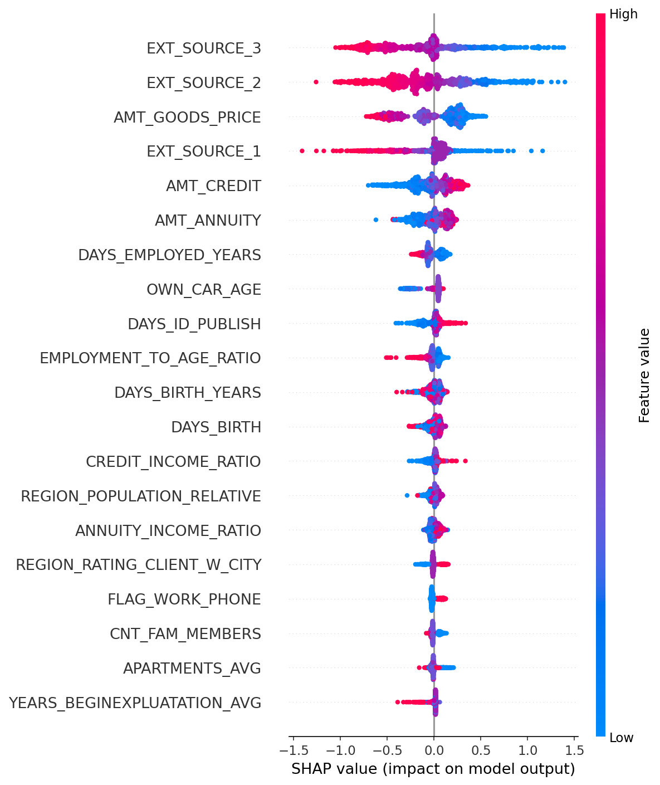
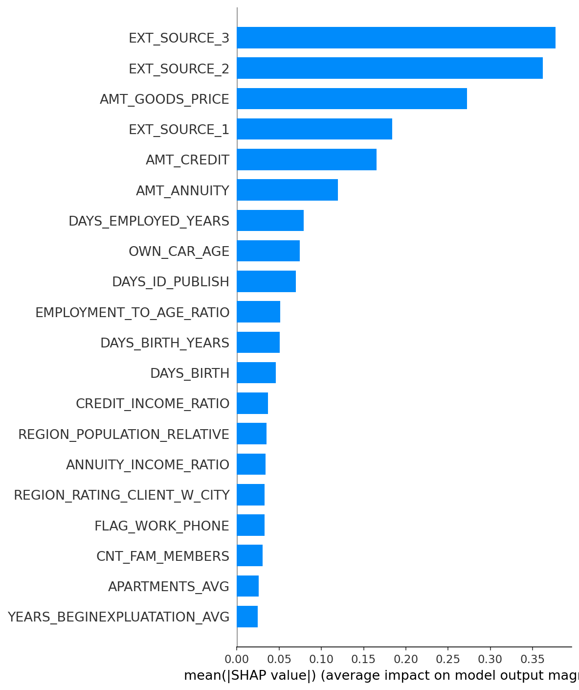

# Credit Risk Default Prediction
### End-to-end machine learning pipeline for loan default classification · Python · XGBoost · Power BI

---

## Overview

This project builds a full credit risk analytics pipeline on the [Home Credit Default Risk dataset](https://www.kaggle.com/c/home-credit-default-risk/data) (307,511 applicants, 122 features). The goal is to predict the probability that a borrower will default on a loan — framed not just as a modelling exercise, but as a business decision-support tool for credit officers.

**Final model:** XGBoost classifier · ROC-AUC: `[your score]` · Precision@10%: `[your score]`

> 📊 [View the interactive Power BI dashboard](#) ← replace with your link

---

## Business Context

Traditional credit scoring often excludes applicants with limited credit history, creating both financial risk and missed opportunity for lenders. This analysis uses alternative applicant data — income, employment, family status, prior credit bureau behaviour — to build a more complete default risk picture.

**Key question answered:** *Which borrower segments carry disproportionate default risk, and what variables drive those outcomes?*

---

## Project Structure

```
credit-risk-default/
│
├── data/                               # Raw data (not committed — see Data section)
│   ├── application_train.csv
│   ├── application_test.csv
│   └── bureau.csv
│
├── notebooks/
│   ├── 01_eda.ipynb                    # Exploratory data analysis & visualisation
│   ├── 02_feature_engineering.ipynb    # Feature creation & preprocessing
│   ├── 03_modelling.ipynb              # RandomForest Model training and evaluation
│   └── 04_xgboost_modelling.ipynb      # XGBoost Model training, evaluation & SHAP analysis
│
├── outputs/
│   ├── data/                           # Saved training data
│   ├── figures/                        # All saved charts
│   ├── models/                         # Saved models (.pkl)
│   └── results/                        # Various process results
│
├── dashboard/
│   └── credit_risk_dashboard.pbix      # Power BI file
│
├── requirements.txt
└── README.md
```

---

## Data

**Source:** [Kaggle — Home Credit Default Risk](https://www.kaggle.com/c/home-credit-default-risk/data) (free, requires Kaggle account)

**Tables used:**

| File | Rows | Description |
|---|---|---|
| `application_train.csv` | 307,511 | Core application data with target variable |
| `application_test.csv` | 48,744 | Holdout set for final predictions |
| `bureau.csv` | 1,716,428 | Prior credit bureau records per applicant |

**Target variable:** `TARGET` — 1 = payment difficulties (default), 0 = repaid on time

**Class imbalance:** ~8% positive class. Handled via `scale_pos_weight` in XGBoost.

To download via Kaggle CLI:
```bash
pip install kaggle
kaggle competitions download -c home-credit-default-risk
unzip home-credit-default-risk.zip -d data/
```

---

## Methodology

### 1. Exploratory Data Analysis
- Profiled 122 features across 307K applicants
- Identified class imbalance (8% default rate) and missing value patterns
- Key finding: `EXT_SOURCE_1/2/3` (external credit scores) are the strongest predictors

### 2. Feature Engineering
Created domain-driven features grounded in credit analysis logic:

| Feature | Formula | Rationale |
|---|---|---|
| `CREDIT_INCOME_RATIO` | `AMT_CREDIT / AMT_INCOME_TOTAL` | Debt burden relative to income |
| `ANNUITY_INCOME_RATIO` | `AMT_ANNUITY / AMT_INCOME_TOTAL` | Monthly repayment affordability |
| `EMPLOYMENT_TO_AGE_RATIO` | `DAYS_EMPLOYED / DAYS_BIRTH` | Job stability relative to career stage |
| `BUREAU_ACTIVE_LOANS` | Aggregated from `bureau.csv` | Current external credit exposure |

### 3. Modelling

| Model | ROC-AUC | Notes |
|---|---|---|
| Logistic Regression (baseline) | `[score]` | After scaling & imputation |
| XGBoost | `[score]` | Tuned via RandomizedSearchCV |

### 4. Explainability (SHAP)
Used SHAP TreeExplainer to surface the top drivers of default probability — making the model interpretable for non-technical credit officers.

**Top predictors of default:**
1. `EXT_SOURCE_2` — external credit score (lower = higher risk)
2. `EXT_SOURCE_3` — secondary credit score
3. `CREDIT_INCOME_RATIO` — high debt-to-income flags elevated risk
4. `DAYS_EMPLOYED` — shorter employment tenure correlates with default
5. `AMT_GOODS_PRICE` — loan purpose and size matter

---

## Model Performance

| Model | ROC-AUC | Precision@80%Recall | Notes |
|-------|---------|---------------------|-------|
| Random Forest (baseline) | 0.701 | — | Simple, no tuning |
| Random Forest (optimized) | 0.737 | — | class_weight='balanced' |
| **XGBoost (tuned)** | **0.753** | **13.6%** | RandomizedSearchCV, SHAP |

---

## Key Business Findings

### 1. External Credit Scores Dominate Prediction

SHAP analysis confirms `EXT_SOURCE_2`, `EXT_SOURCE_3`, and `EXT_SOURCE_1` are the top three predictors of default.

| Credit Score Range | Default Rate | Risk vs. High Score |
|-------------------|--------------|---------------------|
| `EXT_SOURCE_2` < 0.3 (Low) | **15.88%** | **3.5× higher** |
| `EXT_SOURCE_2` > 0.6 (High) | 4.56% | Baseline |

**Business implication:** Applicants with scores below 0.3 should trigger enhanced review. This single flag identifies a segment with nearly 4x the risk of high-score applicants.

### 2. Debt Burden Shows Non-Linear Risk

Unlike the common assumption that "higher debt = higher risk," our analysis reveals a peak in the middle:

| Debt-to-Income Band | Default Rate | Insight |
|--------------------|--------------|---------|
| Low (≤2x) | 7.43% | Safest group |
| **Medium (2x-3.5x)** | **8.81%** | **Peak risk** |
| High (>3.5x) | 7.95% | Slightly lower |

**Why this happens:** Applicants with very high debt burdens may be higher income or have compensating factors (good credit scores). The medium band contains more marginal borrowers.

**Business implication:** Use multi-band thresholds, not a single cap.

### 3. Employment Tenure is a Material Risk Factor

| Employment Length | Default Rate | Risk Multiplier |
|------------------|--------------|-----------------|
| < 1 year | **10.98%** | **1.7×** |
| > 5 years | 6.41% | Baseline |

**Business implication:** Short-tenure employees, particularly young professionals, represent a distinct risk segment. Consider alternative verification (e.g., employment contract, industry stability) for this group.

### 4. Thin-File Applicants (No Bureau History)

Only 0.1% of applicants in this dataset lack bureau history, and they show no elevated risk (8.14% vs 8.07%). This finding is dataset-specific; in Hong Kong's context with high young professional immigration, thin-file risk may be more significant and warrants separate analysis.

### 5. Model Performance

| Model | ROC-AUC | Business Utility |
|-------|---------|------------------|
| XGBoost (tuned) | **0.753** | Captures 80% of defaults while reviewing only the top 13.6% of applicants — 2x more efficient than random selection |

### 6. SHAP Feature Importance

The SHAP summary plot below shows which features push default probability up (red/high values) vs down (blue/low values):



*Interpretation: Low values of EXT_SOURCE_2/3 (blue) push risk higher; high values (red) reduce risk.*



*Average impact magnitude: External credit scores have the largest influence, followed by loan amount (`AMT_GOODS_PRICE`) and credit amount (`AMT_CREDIT`).*

---

**Key takeaway for credit officers:** Focus on external credit scores first — they are your strongest signal. Use DTI as a secondary flag, but be aware that the 2x-3.5x band contains hidden risk. Short employment tenure is a material risk factor worth investigating further.

---

## Dashboard

Built in Power BI with three views:

1. **Portfolio Overview** — default rate by loan type, income bracket, and family status
2. **Risk Segmentation** — borrower risk score distribution across key variables
3. **Model Insights** — SHAP feature importance with business interpretation

> 📊 [View on Tableau Public / Power BI Web](#) ← replace with your published link

---

## Setup & Reproduction

```bash
# Clone the repo
git clone https://github.com/GaudiHan/Credit-Risk-Default-Prediction.git
cd Credit-Risk-Default-Prediction

# Install dependencies
pip install -r requirements.txt

# Download data (see Data section above)

# Run notebooks in order
jupyter notebook notebooks/01_eda.ipynb
```

**Requirements:**
```
pandas==2.1.0
numpy==1.26.0
scikit-learn==1.3.0
xgboost==2.0.0
shap==0.43.0
matplotlib==3.8.0
seaborn==0.13.0
jupyter==1.0.0
```

---

## Skills Demonstrated

`Python` `Pandas` `XGBoost` `Scikit-learn` `SHAP` `Feature Engineering` `Power BI` `Imbalanced Classification` `Business Communication`

---

## Author

**Alexander Gaudi Suhandjaja**
[linkedin.com/in/gaudihan](https://linkedin.com/in/gaudihan) · [github.com/GaudiHan](https://github.com/GaudiHan)